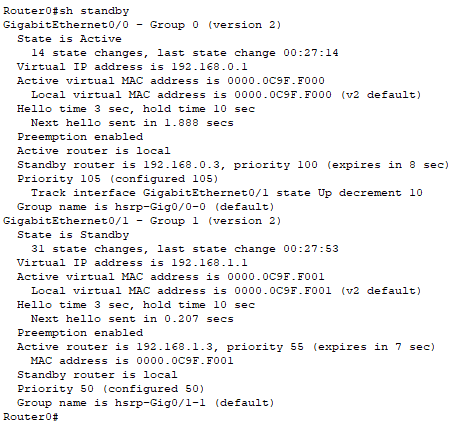
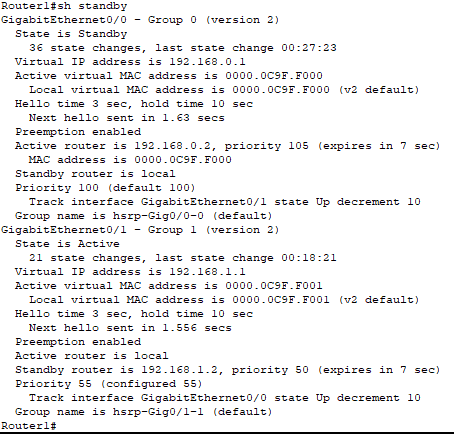
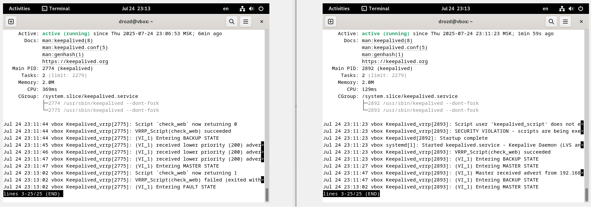

# Домашнее задание к занятию 1 "Disaster recovery и Keepalived" - `Гривняшкин Роман`

### Задание 1

Настройки Router1

Настройки Router2

[Файл схемы pkt](hsrp_grivnyashkinrv.pkt)
---

### Задание 2

Переключение сервера

[keepalived config](keepalived.conf)

[script](check_web_server.sh)
